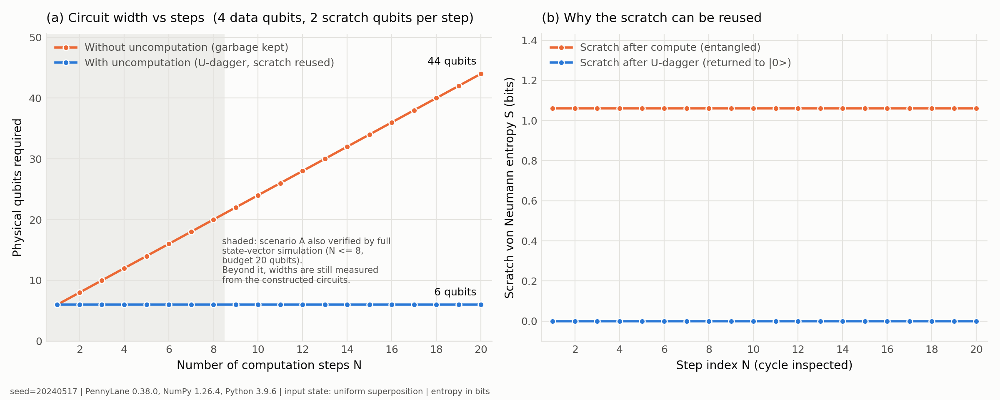

# Uncomputation with U&dagger; — qubit-efficiency demonstration

A reproducible demonstration that **uncomputing scratch qubits with the inverse
subroutine `U†` turns an `O(N)` ancilla requirement into `O(1)`** — and, more
importantly, a measurement of *why* that is safe and of what breaks when you skip it.

Two deliverables:

| | |
|---|---|
| `uncomputation_demo.py` | PennyLane benchmark, `N = 1..20`, with fidelity / trace-distance / entropy validation |
| `simulation/index.html` | standalone browser demo — real state-vector simulation in JavaScript, no backend |



---

## 1. The idea

### What uncomputation is

A quantum subroutine that computes a value needs somewhere to put it. That
somewhere is a **scratch** (ancilla) register, borrowed in state `|0>`:

```
|x> |0>   --U-->   |x> |f(x)>
```

*Uncomputation* is applying `U†` after the result has been used, returning the
scratch to `|0>` so the next step can borrow the same physical qubits:

```
|x> |0>  --U-->  |x> |f(x)>  --use-->  (phase applied)  --U†-->  |x> |0>
```

### Why garbage qubits appear

Quantum evolution is unitary, therefore reversible, therefore it *cannot erase*.
A subroutine that computes `f(x)` cannot simply drop the intermediate values it
produced along the way — they stay in the register. Once `x` is in superposition,
the joint state is

```
sum_x  a_x |x> |g(x)>
```

and the scratch is **entangled** with the data. Those entangled leftovers are
**garbage**. They are not merely untidy; they are two distinct problems at once:

1. **They cannot be reused.** Overwriting a qubit that is entangled with your
   data corrupts the data. So every step must allocate fresh scratch, and the
   circuit width grows linearly in the number of steps.
2. **They destroy interference.** `|g(x)>` is a *which-path record*: an
   environment that has learned which branch the computation took. Tracing it out
   leaves the data register in a mixture, and every quantum algorithm that depends
   on interference — which is all of the interesting ones — stops working.

### Why U&dagger; removes it

`U†` is the exact inverse of the map that created the garbage, so it drives the
scratch back to `|0>` **deterministically and coherently**, for every branch of the
superposition simultaneously. It does not measure, discard, or reset anything; it
unwinds. Because the scratch ends in a product state `|0>` uncorrelated with the
data, the which-path record is erased and the data register is left pure. The
sandwich `U → use → U†` implements the intended logical operation and nothing else.

This is Bennett's construction (see *References*).

### Why qubit efficiency matters

Circuit width is the scarcest resource in quantum computing. Physical devices have
hard qubit limits, and under error correction each *logical* qubit consumes many
*physical* ones — so a linear-in-`N` scratch requirement multiplies straight through
into the physical qubit budget. A circuit needing 44 qubits instead of 6 is not 7×
more expensive to run; frequently it is the difference between running and not
running at all.

---

## 2. What is actually implemented

**Logical target.** An `N`-step phase oracle on `n_data` qubits:

```
U_logical |x>  =  exp( i * sum_k theta_k * p_k(x) ) |x>
```

`p_k(x)` is a conjunction of three signed literals of `x`, drawn from a seed.

**The compute step.** Each `U_k` is two Toffolis writing into two scratch qubits:

```
t = l_a AND l_b        (first Toffoli)
r = t   AND l_c        (second Toffoli, reads t)
```

The two Toffolis **do not commute** — `t` is the target of the first and a control
of the second — so `U_k` is deliberately *not* self-inverse and `qml.adjoint(U_k)`
is a genuine adjoint rather than a second copy of `U_k`. This is asserted
numerically (`test_compute_step_is_not_self_inverse`), not just claimed here.

| | Scenario A — naive | Scenario B — uncomputation |
|---|---|---|
| scratch | a fresh `(t_k, r_k)` per step | one `(t, r)` pair |
| cleanup | none | `adjoint(U_k)` after each use |
| width | `n_data + 2N` | `n_data + 2` |

**Widths are measured, not asserted.** They are read off the constructed circuit
via `qml.tape.make_qscript(...).wires`, so the scaling claim is an observation
about the circuit rather than a formula restated in a comment.

### Two simulation methods

Scenario A needs `2**(n_data + 2N)` amplitudes, which is hopeless past `N ≈ 8`.
So the benchmark runs two methods and checks them against each other:

* **M1 — full PennyLane state vector.** Exact; capped by `--max-sim-qubits`.
* **M2 — structured exact model.** Because every compute step is a classical
  reversible Boolean map and every "use" is diagonal in the computational basis,
  scenario A's global state is `sum_x a_x e^{i phi(x)} |x>|g(x)>`, so the reduced
  data state is

  ```
  rho_A[x, x'] = a_x a_x'^* e^{i(phi(x) - phi(x'))} * [ g(x) == g(x') ]
  ```

  This costs `2**n_data` memory regardless of `N`. It is exact **for this circuit
  class only** — it is not a general-purpose simulator.

M2 is used at large `N` **only because** it agrees with M1 wherever both run
(worst deviation `4.9e-17`). That agreement is a test, not an assumption.

---

## 3. Results

Produced by `python uncomputation_demo.py`, seed `20240517`, `n_data = 4`,
PennyLane 0.38.0 / NumPy 1.26.4 / Python 3.9.6.

### Qubit scaling — measured from the circuits

| N | without uncomputation | with uncomputation | saved |
|---|---|---|---|
| 1 | 6 | 6 | 0 |
| 5 | 14 | 6 | 8 |
| 10 | 24 | 6 | 18 |
| 20 | **44** | **6** | **38** |

Growth is exactly `+2` qubits per step without cleanup and `+0` with it, over the
whole range `N = 1..20`.

### Correctness — scenario B reproduces the logical target

Compared against an independently computed reference state (classical phase
accumulation; no circuit involved), for every `N = 1..20`:

```
fidelity        >= 0.999999999999999      (Uhlmann, squared convention)
trace distance  <= 8.6e-16
```

### The scratch register across one compute/uncompute cycle

```
                    before U†        after U†
entropy S         1.061278124 bits   <= 1.3e-15 bits
purity Tr(rho^2)  0.593750000        1.000000000
```

Both before-values match closed form exactly, which is a useful check that the
partial trace is right: over a uniform input the scratch pair `(t, r)` takes value
`(0,0)` for 12 of 16 basis states and `(1,0)`, `(1,1)` for 2 each, giving

```
S      = -0.75*log2(0.75) - 2*(0.125*log2(0.125))  = 1.06128 bits
purity = 0.75^2 + 0.125^2 + 0.125^2                = 0.59375
```

After `U†` the scratch is `|00>` to machine precision — not merely unentangled but
in the specific state needed for reuse, which is checked separately
(`test_scratch_returns_to_the_zero_state_exactly`).

### The part the headline usually omits

"Fidelity ≈ 1 between the two scenarios" is **only true for computational-basis
inputs.** Comparing each scenario's data register against the logical target:

| input state | scenario A (garbage kept) | scenario B |
|---|---|---|
| computational basis | F = 1.000000000, T = 0 | F = 1, T < 1e-15 |
| uniform superposition | F falls 0.594 → **0.0625**, T rises to 0.938 | F = 1, T < 1e-15 |

On a basis input the garbage is a deterministic label and costs nothing. On a
superposition it is a which-path record, and the data register decoheres. The
`0.0625` floor is `1 / 2**n_data` — the maximally mixed limit, reached once the
garbage distinguishes all 16 basis states.

**So uncomputation is not only an optimisation.** For any algorithm that relies on
interference, skipping it is a correctness bug that a qubit-count table would never
reveal.

### Cross-validation

* M1 vs M2 (Python), `N = 1..8`: worst `|Δρ| = 4.865e-17`
* Python vs JavaScript, identical problem instance: 16/16 metrics agree to ~1e-15
* Test suite: 20/20 checks pass

---

## 4. Running it

Requires Python 3.9+.

```bash
python -m venv .venv
source .venv/bin/activate          # Windows: .venv\Scripts\activate
pip install -r requirements.txt
```

> `autoray` is pinned to 0.6.12: PennyLane 0.38 imports `autoray.autoray.NumpyMimic`,
> which autoray 0.7+ removed. Without the pin, `import pennylane` fails outright.

### The benchmark

```bash
python uncomputation_demo.py
```

Writes `qubit_scaling_comparison.png` and `benchmark_results.json`, and prints all
four tables above. Useful flags:

```bash
python uncomputation_demo.py --max-steps 12 --n-data 5 --seed 7
python uncomputation_demo.py --max-sim-qubits 22    # simulate scenario A further
python uncomputation_demo.py --no-plot --log-level DEBUG
python uncomputation_demo.py --help
```

`--max-sim-qubits` is the memory budget for method M1 (`2**20` complex128 = 16 MiB
by default). Raising it extends the fully state-vector-verified range at the cost of
memory; the shaded band in panel (a) of the figure always shows how far it reached.

### Bit-identical reproduction

All reported physical quantities are already bit-identical across runs. One
diagnostic is not: `m1_m2_max_deviation` is a pure round-off residual (~5e-17)
whose last digits move between runs, because multithreaded BLAS does not fix the
summation order of the large matrix product inside `partial_trace`. To pin it:

```bash
OMP_NUM_THREADS=1 OPENBLAS_NUM_THREADS=1 MKL_NUM_THREADS=1 \
VECLIB_MAXIMUM_THREADS=1 python uncomputation_demo.py
```

Verified: 3/3 single-threaded runs byte-identical, versus a differing 6th
significant digit in that one field with threading on. This is floating-point
summation order, not physics.

### The tests

```bash
python test_uncomputation.py        # standalone — no pytest needed
pytest -v test_uncomputation.py     # or under pytest, if you have it
```

### The browser simulation

No build step and no server:

```bash
open simulation/index.html          # macOS
xdg-open simulation/index.html      # Linux
```

> **Downloading just one file?** Take `simulation/standalone.html`, not
> `index.html`. `index.html` loads its logic from `app.js` alongside it, so on its
> own it renders an empty shell with no circuits and no numbers — it looks broken
> when it is merely incomplete. `standalone.html` has the JavaScript inlined and
> works entirely on its own. Regenerate it after editing `app.js`:
>
> ```bash
> python simulation/build_standalone.py
> ```

Drag the **N** slider (1–10) to update the circuit diagrams, qubit counters, memory
chart and ancilla inspector. Every number is computed live from an actual complex
state vector in the page; nothing is pre-baked. The page runs its own internal
checks on load and reports the result at the bottom.

### Cross-language verification

Checks the JavaScript simulator against the Python reference on an identical
problem instance:

```bash
python uncomputation_demo.py --no-plot --emit-js-fixture simulation/fixture.js
/System/Library/Frameworks/JavaScriptCore.framework/Versions/Current/Helpers/jsc \
    simulation/app.js simulation/fixture.js simulation/verify_core.js
```

With Node instead of JavaScriptCore — **untested**, as the machine this was
developed on has no Node installed; the JavaScriptCore path above is the one that
was actually run:

```bash
node -e "global.FIXTURE=require('./simulation/fixture.js'); \
         global.UncomputationCore=require('./simulation/app.js'); \
         global.print=console.log; require('./simulation/verify_core.js')"
```

---

## 5. Validation criteria

These were fixed **before** the implementation was written, so that no success
criterion is reverse-engineered from the numbers that came out.

| | Criterion | Result |
|---|---|---|
| V1 | scenario B vs logical target: F ≥ 1−1e-9, T ≤ 1e-9, all `N` | pass |
| V2 | scratch S > 0.1 bit after compute, ≤ 1e-9 after `U†`; purity → 1 | pass |
| V3 | basis input: A and B agree, F ≥ 1−1e-9 | pass |
| V4 | superposition input: A and B **disagree**, F < 0.99, T > 0.01 | pass |
| V5 | M1 vs M2 agree to ≤ 1e-9 on every overlapping `N` | pass (4.9e-17) |
| V6 | measured widths: `+2`/step naive, `+0`/step uncomputed | pass |

---

## 6. Limitations and caveats

Read this before quoting the `O(1)` result.

* **`O(1)` scratch holds for *sequential, independent* steps** — the structure
  implemented here, where each step's result is consumed before the next begins. It
  does **not** hold for arbitrary computation. When a later step depends on an
  earlier step's intermediate value, you cannot uncompute it yet, and the achievable
  space/time trade-off is governed by Bennett's reversible pebbling result — buying
  space back costs time. Do not generalise the flat blue line to "uncomputation
  always makes ancillas free".
* **Noiseless simulation.** No decoherence, no gate error, no sampling noise. On
  hardware, `U†` doubles the gate count of each step, trading circuit *width* for
  circuit *depth* — and on a NISQ device that trade is not automatically favourable.
  This demo measures width only; it says nothing about which is better on a real
  machine.
* **Scenario A above `N = 8` is not full state-vector simulated** (it would need up
  to 44 qubits). Its metrics come from model M2, which is validated against M1 for
  `N ≤ 8`. Qubit counts are exact at every `N` — they are structural.
* **One problem family.** Conjunctions of three signed literals with a phase
  kickback. The result is checked across four extra seeds and a wider data register,
  but a different circuit class could behave differently.
* **Fidelity convention.** Uhlmann, *squared* (`F = 1` for identical states,
  `F = |<psi|phi>|^2` for pure states). Some texts report its square root.
* **The browser build uses its own seeded generator**, so its predicates differ from
  the Python benchmark's at the same seed. Structural results are identical either
  way; the cross-language check hands both the same instance explicitly.

### Reviewer notes — what was and was not checked

Checked: partial-trace wire ordering against a live circuit (`verify_bit_order`);
metrics against analytically known states; that `U ≠ U†` numerically; that the
compute step writes the predicate the *independent classical model* says it should;
seed robustness (4 extra seeds); `n_data` robustness (4 and 6); two independent
simulation methods in Python; two independent implementations across two languages;
that fidelity never exceeds 1 and entropy is never negative.

Not checked: hardware or noisy-simulator behaviour; gate-count/depth trade-offs;
circuit classes other than the one implemented; `n_data` above 6; whether a
classical baseline would suffice for the underlying task (not applicable — this
demonstrates a circuit-construction property, not an algorithmic advantage claim).

---

## 7. References

Cited at chapter granularity; these are standard references for the construction,
not the source of any specific number reported above. They were not independently
re-verified in this repository.

* C. H. Bennett, "Logical reversibility of computation", *IBM Journal of Research
  and Development* **17**(6), 525–532 (1973). — the compute/copy/uncompute
  construction that removes garbage from reversible computation.
* C. H. Bennett, "Time/space trade-offs for reversible computation", *SIAM Journal
  on Computing* **18**(4), 766–776 (1989). — the reversible pebbling trade-off
  behind the caveat above.
* M. A. Nielsen and I. L. Chuang, *Quantum Computation and Quantum Information*,
  10th Anniversary Edition, Cambridge University Press (2010). — Ch. 3 for
  reversible computation and garbage; Ch. 9 for fidelity and trace distance.

---

## 8. Layout

```
uncomputation_demo.py          benchmark, metrics, figure, CLI
test_uncomputation.py          20 validation checks (V1–V6 + robustness)
qubit_scaling_comparison.png   generated figure
requirements.txt               pinned dependencies
simulation/
  index.html                   standalone page, light + dark
  app.js                       state-vector simulator + rendering
  standalone.html              single-file build (JS inlined) -- use this for a one-file download
  build_standalone.py          regenerates standalone.html from index.html + app.js
  verify_core.js               headless cross-language verification
  fixture.js                   generated problem instance + Python reference values
```
